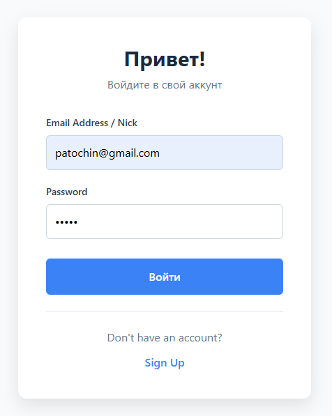
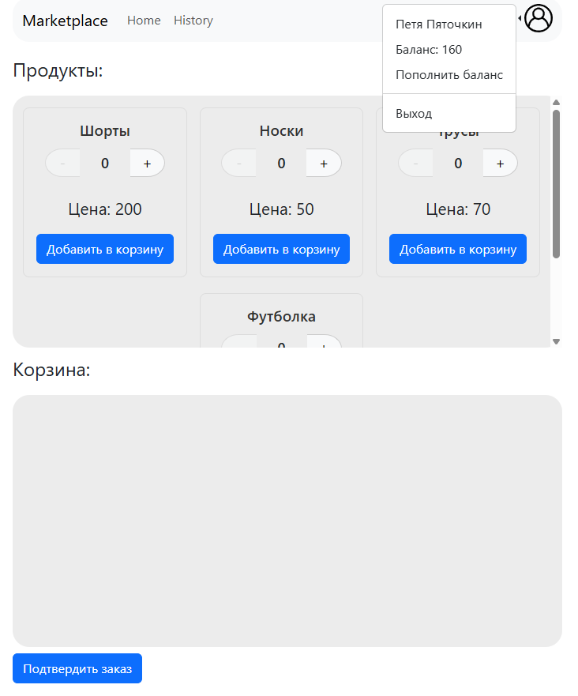
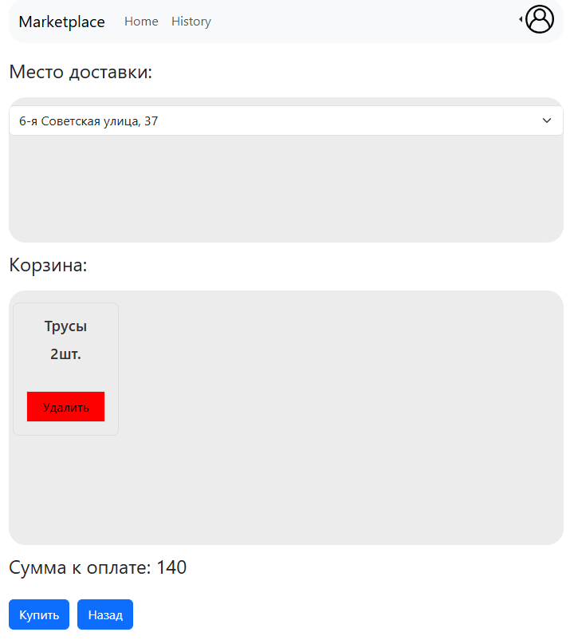

# MarketPlace
Asp.net Core проект маркетплейса с микросервисной архитектурой, Postgresql базами, Apache Kafka, REST и GRPC взаимодействием.
Проект полностью упакован в docker-compose.

Проект Marketplace является веб-приложением магазина. Данный проект позволяет просматривать каталог товара,
создавать заказ, оформлять заказ в выбранное пользователем место (пункт выдачи) и осуществлять покупку.

Веб приложение содержит авторизацию, и у пользователя есть имя и баланс кошелька.

Ниже приведены экраны приложения:

Экран авторизации.

Экран каталога товаров и корзины.

Экран оформления заказа.

Экран осуществленных покупок.

This repo contains docker-compose file, so if you have installed docker in your computer:
1) run "docker-compose up -d"
2) go to "http://localhost:3000/"
3) login with user "patochin@gmail.com" and password "12345"
4) enjoy it !!!
